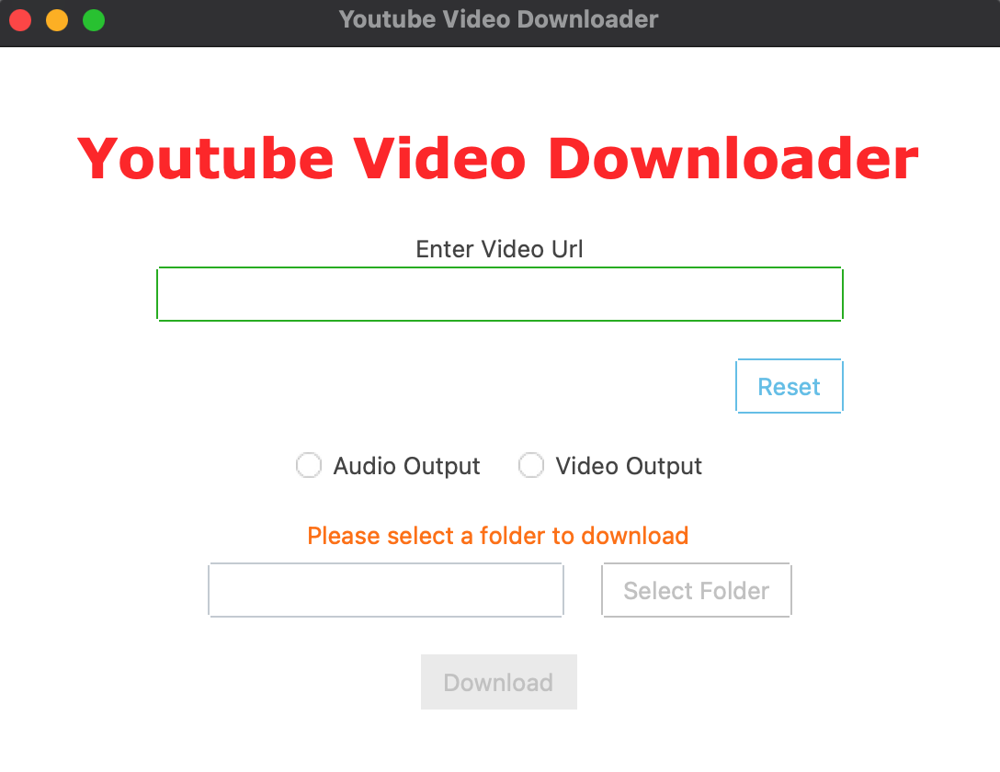

# YouTube Downloader

A simple and efficient YouTube video downloader built using Python. This application uses the `tkinter.ttk` framework for its user interface and the `pytubefix` library to download videos and audio from YouTube.

## Features

- Download videos from YouTube in various resolutions.
- Extract and download audio from YouTube videos.
- User-friendly interface built with `ttkinter` for a native platform look and feel.
- Cross-platform compatibility.

## Requirements

- Python 3.7 or higher
- `pytubefix` library
- `ttkinter` (comes pre-installed with Python)

## Installation

1. Clone this repository or download the zip file:
   ```bash
   git clone https://github.com/your-username/youtube-downloader.git
   cd youtube-downloader
   ```

2. Install the required library:
   ```bash
   pip install pytube
   pip install ttkbootstrap
   ```

3. Run the application:
   ```bash
   python main.py
   ```

## How to Use

1. Open the application.
2. Paste the YouTube video URL into the input field.
3. Choose between video or audio download.
4. Click the "Download" button and wait for the file to save.

## Screenshots



## Technologies Used

- **Python**: The core programming language.
- **ttkinter**: For building the graphical user interface.
- **pytube**: To handle video and audio downloads from YouTube.

